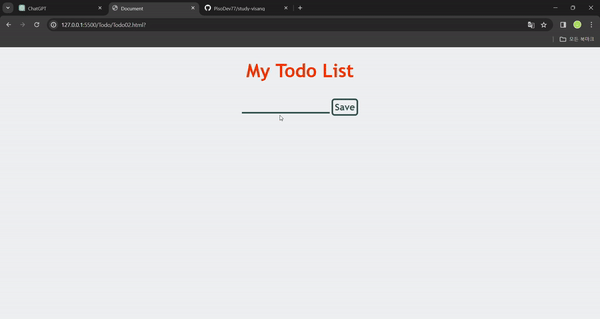

# Todo List 만들기

## Todo List 02

> 24.01.16

-   HTML, CSS 파일을 다운로드하세요. [HTML](https://github.com/PisoDev77/study-visang/blob/main/Todo/Todo02.html) / [CSS](https://github.com/PisoDev77/study-visang/blob/main/Todo/Todo02.css)
-   화면에 맞게 `Todo02.js`파일을 작성하세요.
